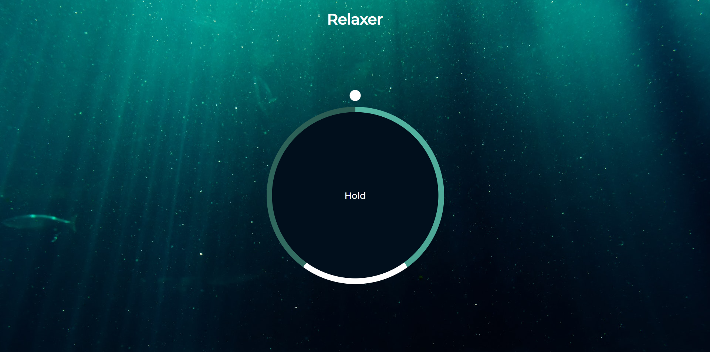

# Relaxing Web App
`Author:` Padmanabh Belavadi

This is the project based on the idea of `Relaxing Breath-in, Out App`. it is completely build using core `HTML` `CSS` and `Javascript`

## My Project Looks Like :

## Reach Me Out on

 [Linkedin](https://www.linkedin.com/in/padmanabh-belavadi)

 [GitHub](https://github.com/padmanabh-b)

 [Instagram](https://www.instagram.com/legend_padmanabh/)

 [Findcoder](https://www.findcoder.io/u/padmanabh_b)

# Deployed Link
[Get Relax](https://relaxing-webapp.netlify.app/)
